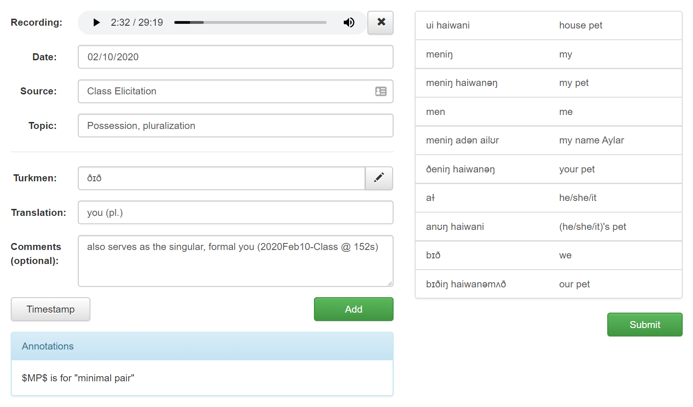

## University of Kansas Projects

### Linguistics Fieldnotes
*January 2020 – Present*
- Frontend written in Bootstrap for students to transcribe audio recordings
- PHP backend receives transcriptions from students to store in OneDrive using [rclone](https://rclone.org/)

### KU Solar Car Driver Dashboard
*August 2019 – Present*
- Developed from scratch using HTML/CSS and JavaScript (with [gauge.js library](https://bernii.github.io/gauge.js/))
- Communicates with Flask backend API via AJAX requests
- Utilized [GitHub](https://github.com/dprebyl/DriverHUD) for version control and collaborating with team members

### V=IR
*February 2020*
- Developed an electric grid simulation game for HackKU2020
- Built using vanilla JavaScript with an HTML5 Canvas
[GitHub repo](https://github.com/dprebyl/V-IR) | [Play the game](https://dprebyl.github.io/V-IR/)

You can also check out my [LinkedIn](https://www.linkedin.com/in/drake-p) and my [GitHub account](https://github.com/dprebyl).

