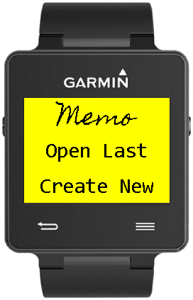
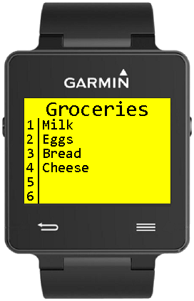

## University of Kansas Projects

### [Linguistics Fieldnotes](https://github.com/dprebyl/LinguisticsFieldnotes)
*January 2020 – April 2020*
- Frontend written in Bootstrap for students to transcribe audio recordings
- PHP backend receives transcriptions from students to store in OneDrive using [rclone](https://rclone.org/)  

### [Connect 4](https://github.com/dprebyl/Connect4)
*March 2020 – April 2020*
- A KU-themed recreation of the classic game playable against another human or an AI
- [Play the game here](https://dprebyl.github.io/Connect4/)

### [KU Solar Car Driver Dashboard](https://github.com/KU-Solar-Car/DriverHUD)
*August 2019 – February 2020*
- Developed from scratch using HTML/CSS and JavaScript (with [gauge.js library](https://bernii.github.io/gauge.js/))
- Communicates with Flask backend API via AJAX requests
- Utilized GitHub for version control and collaborating with team members  

### [V=IR](https://github.com/dprebyl/V-IR)
*February 2020*
- Developed an electric grid simulation game for HackKU2020
- Built using vanilla JavaScript with an HTML5 Canvas
- [Play the game here](https://dprebyl.github.io/V-IR/)  

## Computer Science Academy Group Projects (PHP/JS)

### Certified Nursing Assistant Enrollment
*August 2017 – April 2018*
- Developed from scratch in a team of four over the course of several months
- Validates user inputs and stores data in a Microsoft SQL Server database
- Designed interfaces for students to enroll and administrators to manage courses  

### Academy Applicant Review
*October 2017 – April 2018*
- Continued development on an existing codebase where previous students left off
- Implemented and reworked several features (essay grading pictured below)
- Coordinated with several other groups to divide the workload  

### Student Parking
*April 2018 – May 2018*
- Began a new project to allow students to select parking spaces
- Documented our progress and remaining steps to help future students finish the application  

## Computer Science Academy Individual Projects (Java)

### Basketball Score Tracker
*January 2017 – May 2017*
- Model-View-Controller Java application with over 1,000 lines of code
- Created a Swing GUI with menus, preferences, and data storage files  

### Single Player Battleship
*April 2017 – May 2017*
- Created a fully functional game with modes for time trial or limited moves
- Developed an algorithm to place ships on the board without overlapping  

## Other Projects

### GarminIQ: Memo
*September 2016 – December 2016*
- Record and recall notes from a wearable device
- Developed in “Monkey C” language specific to Garmin
- Learned and utilized the Model-View-Controller design pattern  

### Personal Projects
*Early 2016 – Present*
- Develop web applications primarily in PHP and Python on a Raspberry Pi
- Example projects: Home automation, solar system object database, scorekeeper  

### You can also check out my [LinkedIn](https://www.linkedin.com/in/drake-p) and my [GitHub account](https://github.com/dprebyl).

